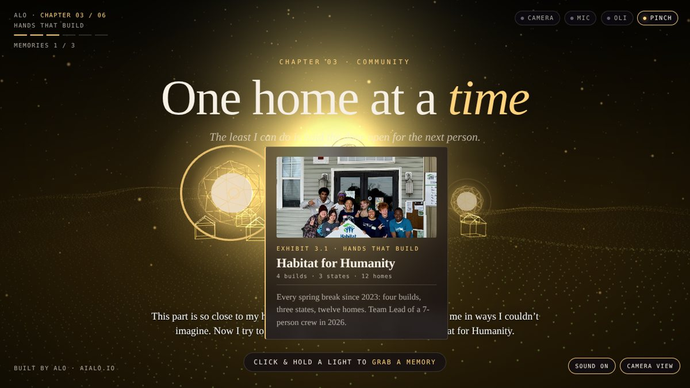

# Alo: Chapters

**An interactive story you move through with your hands.** Open your palm to wake the world, pinch a glowing memory to pull it close, snap your fingers to turn the chapter, or just say "next". It runs entirely in the browser with a webcam and microphone.

It's the story of [Aloysious Kabonge](https://aialo.io), told in eleven chapters: Kampala's seven hills and its wildlife, Buganda food, drums and dance, a 23-hour crossing to Fredericksburg, Habitat builds, open doors, building AI, soccer and movie nights, Michael Jackson, faith, the road ahead to Europe, and today.



## Try it

- **Live:** see the Vercel URL in the repo's About panel
- **Demo without a camera:** add `?demo` to the URL (a ghost hand plays through it)
- **Jump to a chapter:** `?ch=3`

| Gesture | What happens |
|---|---|
| Open palm, held ½ s | The world wakes: sunrise, title, narration in Alo's own voice |
| Pinch near a light | Pull a memory close and read its museum placard |
| Snap your fingers | Next chapter (with title card, letterbox and a new world) |
| Move your hand | The camera follows |
| Say "next", "back", "map", "Oli otya", "where am I", "mute" | OLI, the voice assistant, responds (Chrome/Edge) |
| Phone / touch | Tap to wake, press and hold a light, swipe to turn, Chapters button |
| Mouse / keys | Click to wake · click & hold to grab · **Space**/**→** next · **←** back · **C** chapters · **M** mute · **P** camera view |

## How it works

- **Hand tracking:** [MediaPipe HandLandmarker](https://ai.google.dev/edge/mediapipe/solutions/vision/hand_landmarker) (21 points per hand) runs on-device via WebAssembly and the GPU, with a CPU fallback.
- **Gestures** (`src/gestures.js`) are scale-invariant ratios: pinch = thumb-to-index distance ÷ hand size, with hysteresis so grabs don't flicker.
- **Snap detection:** a chapter only turns when the mic hears a sharp 2.2–9 kHz burst **and** the camera saw the thumb touch the middle finger within the previous 0.6 s. Requiring both rejects keyboard clicks, desk taps and claps. With no microphone, a silent "flick" (thumb holds on the middle finger, then flicks off) works instead.
- **The world** (`src/world.js`, `src/setpieces.js`) is Three.js: particle hills, a gradient sky with a rising sun, and one set piece per chapter (crowned cranes, the Rappahannock and a plane's trail, twelve Habitat homes rising, opening doors, a neural-network sky, a dawn constellation).
- **Sound:** chapter narration uses Alo's recorded voice; the score is composed live with Web Audio: amadinda-style xylophone and drums for Buganda, guitar, piano, hymn organ, church bells and a finger-snap groove (no recordings or licenses).
- **Privacy:** video and audio never leave the browser. Nothing is recorded or uploaded.

See **docs/ARCHITECTURE.md** and **docs/DESIGN.md** for how it fits together and why.

## Edit the story

Everything a visitor reads lives in **`src/story.js`**: chapter titles, lines, colors, set pieces and the three memories per chapter (`t` title, `meta` placard line, `p` text, optional `img` and `voice`). Photos and voice clips live in `public/assets/`.

## Develop

```bash
npm install
npm run dev        # builds dist/ and serves http://localhost:5173 (camera needs localhost or https)
npm test           # gesture + story unit tests (Node)
npm run smoke      # browser smoke test (needs: npx playwright install chromium)
```

On Windows you can double-click `start.bat`.

`npm run build` copies the app into `dist/`, vendors the pinned Three.js and MediaPipe files from `node_modules` (served from this domain), and caches the 7.5 MB hand model. If the model download fails, the app loads it from Google's CDN at runtime.

## Deploy

Vercel builds this automatically from `main` using `vercel.json` (`npm run build` → `dist/`). The `Permissions-Policy` header allows camera and microphone on this origin only.

## Team

This repo is worked on by Alo's AI office (Claude, Codex, Grok). See `AGENTS.md`.
